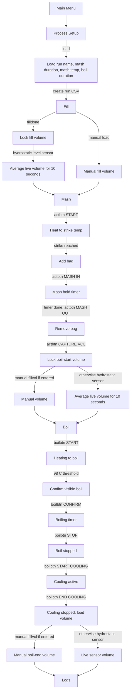
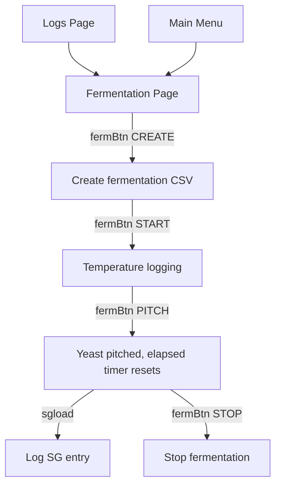
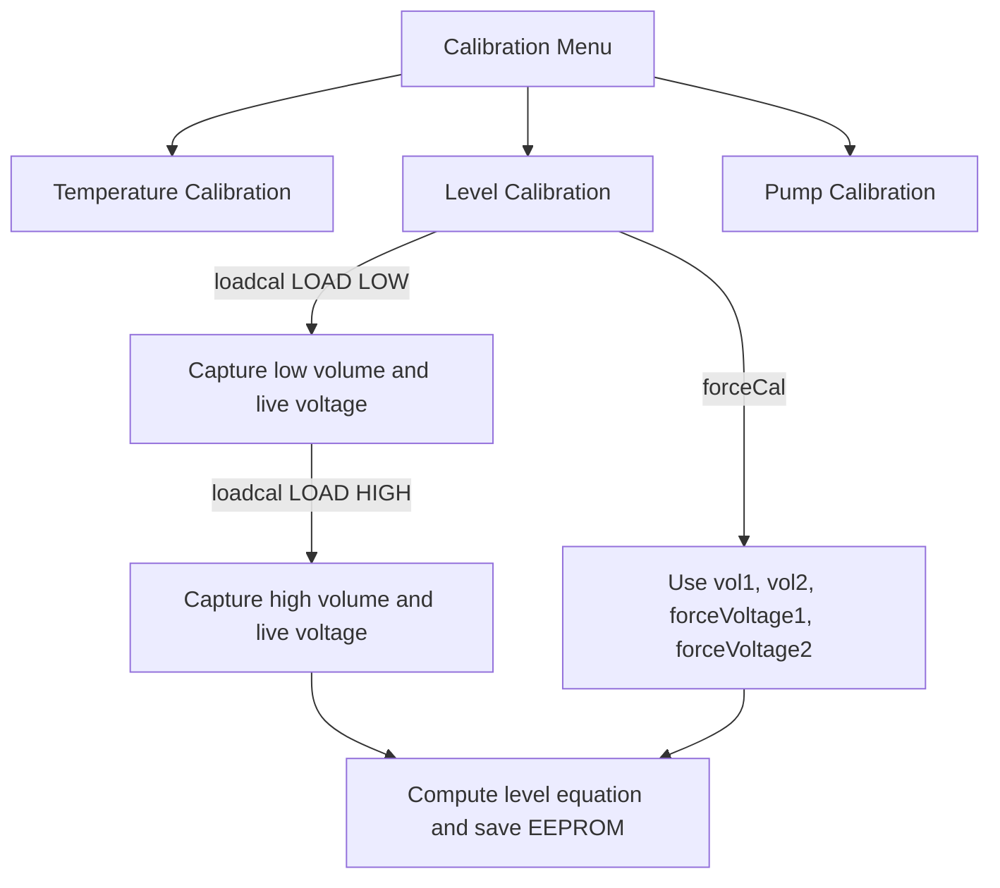

# Brew Controller Process Flow

This document summarizes the current HMI process flow and the data captured or monitored by each stage.

## Main Brew Flow

## Fermentation Flow

## Calibration And Support Flow

## Captured And Monitored Data

| Stage | Monitored live data | Captured / saved data | Log behavior |
| --- | --- | --- | --- |
| Process Setup | SD card status | Run name, mash duration, mash temp, boil duration | Creates run CSV with setup/calibration metadata |
| Fill | Live temperature, heater status, pump status, live volume | Locked fill volume from hydrostatic average or manual entry | Event: `FILL_LOCKED` or `FILL_LOCKED_MANUAL` |
| Mash Heating | Live temp, setpoint, heater/pump, live volume, waveform | Strike reached event | Run log lines during Mash; event: `MASH_START`, `STRIKE_REACHED` |
| Mash Hold | Live temp, mash setpoint, timer remaining, waveform | SG entries if loaded | Run log lines; event: `MASH_IN`, `SG_ENTRY` |
| Mash Out / Capture | Live volume, locked boil-start volume | Manual `fillvol` or averaged hydrostatic volume | Event: `MASH_OUT`, `BOIL_VOL_CAPTURE_START`, `BOIL_VOL_LOCKED` |
| Boil Heating | Live temp, boil status, ETA/update text, waveform | Boil start state | Run log lines during Boil; event: `BOIL_START`, `BOIL_REACHED`, `BOIL_READY_CONFIRM` |
| Active Boil | Live temp, boil timer, control percent, waveform | Boil stop event | Run log lines; event: `BOIL_STOPPED` |
| Cooling On Boil Page | Live temp, cooling estimate, waveform | Cooling start/end, boil-end volume | Event: `COOLING_START`, `COOLING_END`, `BOIL_END_VOL_MANUAL` or `BOIL_END_VOL_TOF` |
| Fermentation | Live temp, min/max temp, 6-hour avg, day avg, elapsed time, SG status, waveform | Fermentation file, yeast pitch, SG entries | Fermentation log every 30 seconds while running; event log for file/start/pitch/stop/SG |
| Level Calibration | Raw voltage, live volume | `vol1`, `vol2`, low/high voltages, slope/intercept | EEPROM save; status shown on LevelCal `status` |
| Temperature Calibration | RTD resistance, live temp | Probe R/T calibration points | EEPROM save and optional calibration log |

## Key Sensors And Derived Values

| Signal | Source | Used for |
| --- | --- | --- |
| Process temperature | MAX31865 RTD path | Fill, Mash, Boil, Cooling estimates, Fermentation logging |
| Level voltage | Hydrostatic pressure sensor analog input | Live volume and fill/boil volume locks |
| Level volume | `levelSlope * voltage + levelIntercept` | Process volume display and automatic volume capture |
| Specific gravity | Manual HMI xfloat input | Mash SG event entries and fermentation SG entries |
| Heater state | Relay output state | Status display and run log |
| Pump state | Pump state variable | Status display and run log |

